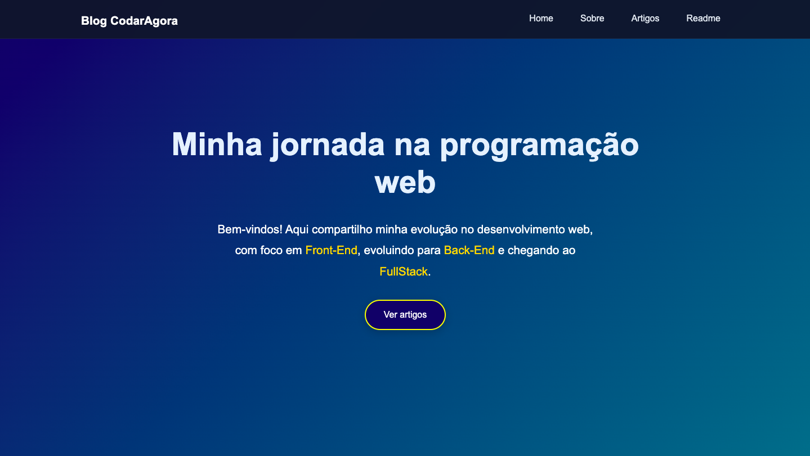

# 🚀 CodarAgora

Projeto desenvolvido durante minha jornada de aprendizado em Desenvolvimento Web Front-End.

O objetivo deste projeto é praticar conceitos modernos de HTML5 e CSS3, criando uma interface responsiva, organizada e visualmente moderna.

---

# 🌐 Projeto Online

🔗 https://clebsonsilva32.github.io/codaragora-blog/

Publicado utilizando GitHub Pages como parte do meu processo de aprendizado em versionamento, hospedagem e desenvolvimento Front-End.

---

# 📸 Preview do Projeto



---

# 🚧 Projeto em Evolução

Este projeto representa minha evolução prática nos estudos de HTML5 e CSS3.

Ainda estou aprendendo diversos conceitos de CSS moderno, responsividade e organização de layouts, aplicando melhorias gradualmente conforme avanço nos estudos.

---

# 📚 Tecnologias Utilizadas

* HTML5
* CSS3
* Flexbox
* Responsividade
* Semântica HTML
* Acessibilidade básica

---

# 🎯 Objetivos do Projeto

Neste projeto estou praticando:

* Estruturação semântica
* Organização profissional do CSS
* Layouts responsivos
* Tipografia fluida com `clamp()`
* Efeitos visuais modernos
* Boas práticas no Front-End
* Estrutura de componentes visuais

---

# 🖥️ Funcionalidades

✅ Header fixo responsivo

✅ Hero Section moderna

✅ Cards de artigos

✅ Layout adaptado para mobile

✅ Hover effects

✅ Estrutura organizada

---

# 📱 Responsividade

O projeto foi desenvolvido pensando em diferentes tamanhos de tela:

* Desktop
* Tablet
* Mobile

---

# 📂 Estrutura do Projeto

```bash
CodarAgora/
│
├── index.html
├── style.css
├── README.md
└── img/
```

---

# 📌 Minha Jornada

Este projeto representa minha evolução nos estudos de Desenvolvimento Web Front-End e também marca meu primeiro contato com Git e GitHub.

Decidi começar a utilizar versionamento desde os primeiros projetos para desenvolver boas práticas, acompanhar minha evolução e me aproximar do fluxo de trabalho utilizado no mercado.

Durante o desenvolvimento do CodarAgora, comecei a aprender conceitos fundamentais como criação de repositórios, commits, histórico de alterações e integração com o GitHub.

Meu primeiro commit neste projeto foi:

```text
dadd75a - Primeira versão do Blog CodarAgora
```

Ainda estou em processo de aprendizado e evolução, buscando aplicar boas práticas, melhorar a organização do código e desenvolver projetos cada vez mais profissionais.

Acredito que compartilhar essa jornada faz parte do crescimento como desenvolvedor, e este repositório registra cada etapa dessa evolução.

---

# 💡 Aprendizados

Durante esse projeto venho evoluindo principalmente em:

* HTML semântico
* Organização de código
* Responsividade
* Estrutura visual moderna
* Planejamento de layouts
* Acessibilidade
* Git e controle de versões

---

# 🚀 Próximos Passos

Pretendo futuramente adicionar:

* JavaScript
* Menu Mobile
* Dark Mode
* Animações avançadas
* Integração com APIs
* Melhorias de acessibilidade
* Versionamento mais avançado

---

# 👨‍💻 Autor

Desenvolvido por Clebson Silva

💻 Desenvolvedor Front-End em formação

🚀 Evoluindo através de projetos reais, estudos contínuos e prática diária.

> Este projeto registra não apenas meu aprendizado em Front-End, mas também meus primeiros passos com Git e versionamento de código. Cada atualização representa um novo aprendizado e um avanço na minha jornada como desenvolvedor.
